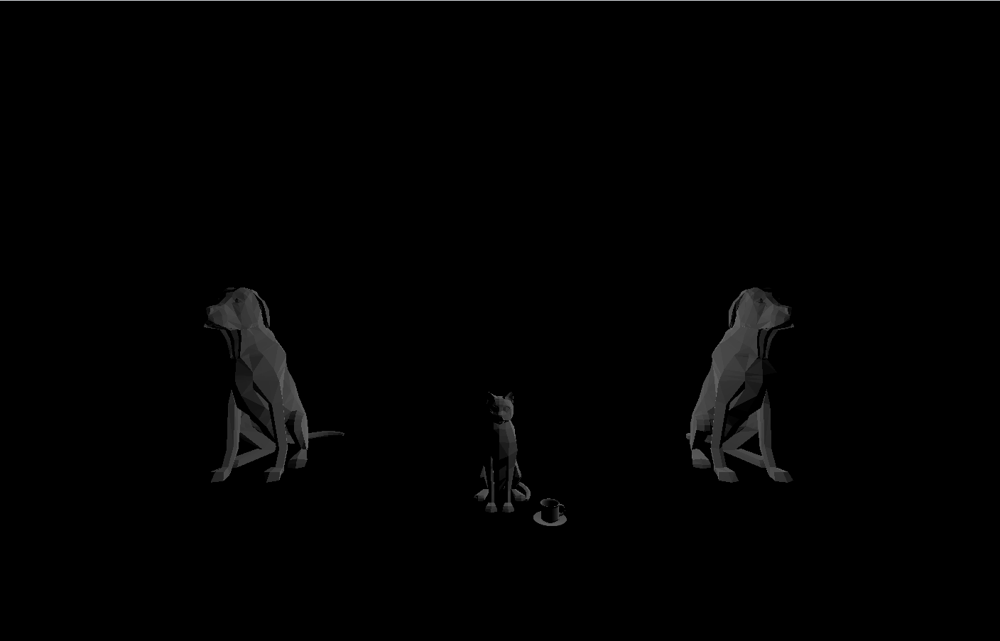
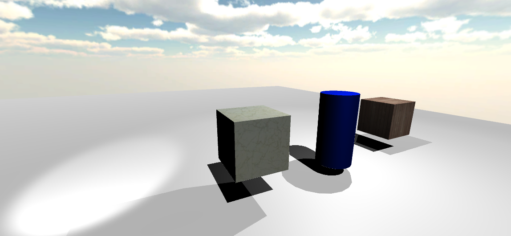

# CMPM163Labs
Lab2 // https://drive.google.com/file/d/1Zmw4LQ_TfZ5EDlsurGaG9ZLc_3P07x5I/view?usp=sharing  "lab2"

Lab3  https://drive.google.com/file/d/1fyk6Cya3j07fXf8YVqvDyj6c_kAWJNih/view?usp=sharing
    Cube on the top right: Example of part1
    
    Cube on the top left: The cube I made by my own without my own shader(the self-made cube for part one)
    
    Cube on the bottom right: Example of part2 with shader
   
    Cube on the bottom left: The cube I made by my own with my own shader interpolated between red and blue and green in order to make it looks like the shader in the header(the self-made cube for part two) 

Lab4 

Quetstions in part2: 
(a). x = 8u
(b). 8 - 8u
(c). x = 8 * 0.375 = 3
     y = 8 - (8 * 0.25) = 6
     white

https://drive.google.com/file/d/19GAlceW1hMDAsCl9E76WtfCZ11NG4hnP/view?usp=sharing

Top left Cub: Without normal map

Top mid Cub: The top left Cub with normal map

Top right Cub: A custom Cub made with normal map

Bottom left Cub: Cube made with the shaders in the example

bottom right Cub: Cube made with my own shader. I use "if" to estimate the blocks of the texture, where should put it. Then I rescaled the texture and put them into the correct place

Lab5

https://drive.google.com/file/d/1qNaPg_AoCLyJV6HvkDyJ0PYBByH0gLW6/view?usp=sharing

https://drive.google.com/file/d/1hqQU1w4EYueQTp3MH3Z9bRrsJZbGiiSb/view?usp=sharing

https://drive.google.com/file/d/1iusEN9e-mUKnynU7142cOwI0tU9CtZR2/view?usp=sharing

For the scene I designed my self, I first array the dots neatly by using the for loop. And in the animation function I animate them back and forth on the Z-axis by using the Sin methhod. So it would make people feel dazzled.

Lab6

Direstional Light: Works like natural light/sun light. Only rotation affects.

Point Light: Light emission from a point, works like a lightbulb. Rotation doesn't affect.

Spot Light: Works like spot lamp. Both Rotation and position affect

Area Light: It shines in all directions to one side of a rectangular plane. Always used to bake something

Material: I tried to simulate the blue on Bud Light bottle. I added up the metallic to max(1) and added some smotheness to about half(0.5)

Texture: A tile texture and a wood texture

Skybox: The sunny day skybox

Lab7 

https://drive.google.com/file/d/10GjIyz0MDbo-9NFwTpi3noHdYYrOVlv2/view?usp=sharing

How I made it:

The Ball on the sea is made with the tutorial.

The river and sea is made with the tutorial.

I made the island by making two planes with the shader made by my own. The white parts is also made with a new shader, I tried to use it to simulate the snow. I also added some simple tree models, its made with simple sphere and cylinder. Also, I added 2 point light to light up the scene

The original part in my partner's scene is the moving ball and the skybox. The ball momve from bot top and change the shape overtime. The skybox is very pretty. I think the position of waves and mountain is pretty well, it fit into the scene. I really like the dusk- like skybox.

Lab8

My scene: https://drive.google.com/file/d/1Zv3BlsHgI4HUKvsp0H_iCY9xkmSF7ze2/view?usp=sharing

Inspiration: https://drive.google.com/file/d/17EQEXseePxVVV8Vb9yDpeekyfEdWiGcP/view?usp=sharing

The changes I made is to add grass lands with trees, and water to my city. It's a city with forst and lake. I simulate the picture that inspired me by adding forest that surround the lake. The lake material is the idea from last lab.
